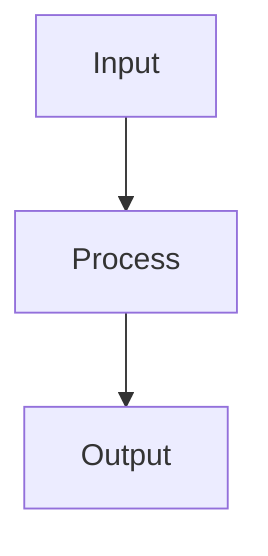

# Evidence Writing Policy

This document defines the rules for evidence-based writing requirements for wiki documentation.

## Core Principles

### 1. Source Citation

**Every major claim must be backed by citations from actual source files.**

- Never guess or infer information
- Never make up line numbers
- Only describe functionality present in source code
- If information is missing, state it explicitly

### 2. Evidence-Based Content

All wiki content must be derived from actual source code:

- **DO**: Read source files and describe what you find
- **DON'T**: Use external knowledge or assumptions
- **DON'T**: Invent functionality not present in the code

## Citation Format

### URL Structure

```
{repo_base_url}/{ref_commit_hash}/{file_path}#L{start}
{repo_base_url}/{ref_commit_hash}/{file_path}#L{start}-L{end}
```

Components:
- `repo_base_url`: Base URL without commit hash (e.g., `https://github.com/owner/repo/blob`)
- `ref_commit_hash`: Git commit hash for permanent links
- `file_path`: Relative path from repository root
- `start`: Starting line number
- `end`: Ending line number (for ranges)

### Link Format

**Single line**:
```markdown
[filename.ext:42](https://github.com/owner/repo/blob/abc123/path/to/file.ext#L42)
```

**Line range**:
```markdown
[filename.ext:42-50](https://github.com/owner/repo/blob/abc123/path/to/file.ext#L42-L50)
```

### Display Text Rules

| Component | Rule | Example |
|-----------|------|---------|
| Filename | Use only the filename (no directory path) | `Button.tsx` not `src/components/Button.tsx` |
| Line numbers | Use actual numbers from file content | `:42` or `:42-50` |
| Separator | Use colon between filename and lines | `Button.tsx:42` |

## Citation Placement

### Inline Citations

Place citations immediately after the claim, **wrapped in parentheses**:

```markdown
The Button component accepts a `variant` prop that controls its appearance ([Button.tsx:15-20](url)).
```

**IMPORTANT**:
- The citation MUST come BEFORE the period (as part of the sentence), not after
- Inline citations MUST be wrapped in parentheses `()` to visually separate them from the surrounding text

**Examples**:
- ✅ Correct: `The function validates input. ([validator.ts:42](url))`
- ❌ Wrong: `The function validates input. [validator.ts:42](url)`

### End-of-Section Citations

Summarize all sources at the end of each section:

```markdown
Sources: [Button.tsx:15-20](url), [types.ts:5-10](url)
<!-- END:AUTOGEN section_id -->
```

### Citation in Tables

Include citations in table cells, **wrapped in parentheses**:

```markdown
| Component | Purpose |
|-----------|---------|
| Button | Renders clickable buttons ([Button.tsx:1-30](url)) |
| Input | Handles text input ([Input.tsx:1-45](url)) |
```

## Citation Requirements

### Citation Distribution

- Spread citations throughout the section
- Don't cluster all citations at the end
- Each major claim should have a citation nearby
- Aim for 3-5 citations per section minimum

### Extracting Line Numbers

1. The line number appears at the start of each line (before `→`)
2. Use these exact numbers in citations
3. Never guess or estimate line numbers

**Example from file read output**:
```
     1→import { App } from './app';
     2→
     3→export function main() {
```

Use: `[main.ts:1-3](url)` or `[main.ts:3](url)`

## Content Quality Guidelines

### 1. Code Examples

- Prefer real code from source files over hypothetical ones
- Include line numbers in citations: `[file.py:42](url)`
- Copy code exactly as shown (excluding the line number prefix)

### 2. Tables (RECOMMENDED)

Use tables to summarize:
- API endpoints (endpoint, method, description)
- Configuration options (name, type, default, description)
- Data models (field, type, description)
- Features (feature, status, description)

**Table Format**:
```markdown
| Field | Type | Default | Description |
|-------|------|---------|-------------|
| `api_key` | string | required | API key for authentication ([config.py:15](url)) |
| `timeout` | int | 30 | Request timeout in seconds ([config.py:20](url)) |
```

### 3. Diagrams

When `diagrams_needed: true`:
- Add Mermaid diagrams to visualize architecture/flow
- Follow `mermaid_policy.md` strictly
- Place diagrams after the introduction paragraph
- Add citations below diagrams

### 4. Language

Generate content in the language specified by locale code:
- Default: `en-US` (English)
- Set via TOC `project.language` field
- All section titles, descriptions, and content follow this language

## What NOT to Cite

Do NOT cite for:
- General programming concepts (e.g., "React components are reusable")
- Standard library functions (e.g., "The `fetch` API makes HTTP requests")
- Well-known patterns (e.g., "MVC separates concerns")
- Your own explanations and summaries

**DO cite for**:
- Specific implementations (e.g., "The Button component uses styled-components ([Button.tsx:5](url))")
- Configuration values (e.g., "Default timeout is 30 seconds ([config.py:20](url))")
- Custom logic (e.g., "The retry logic uses exponential backoff ([retry.ts:15-30](url))")
- API endpoints (e.g., "POST /api/users creates a new user ([routes.ts:42](url))")

## Section Structure Template

```markdown
<!-- BEGIN:AUTOGEN project_01_overview_features -->
## Key Features

Brief introduction to features.

### Feature Category 1

Description of feature category ([module.py:10-20](url)).

| Feature | Description |
|---------|-------------|
| Feature 1 | Description ([file.py:15](url)) |
| Feature 2 | Description ([file.py:25](url)) |

### Feature Category 2

Description with inline citation ([module2.py:5-10](url)).

```python
# Example code ([module2.py:20-30](url))
def feature():
    pass
```



Sources: [module.py:10-50](url), [module2.py:5-40](url)
<!-- END:AUTOGEN project_01_overview_features -->
```

## Common Mistakes

### Mistake 1: Missing Citations

❌ Wrong:
```markdown
The API supports rate limiting with a default of 100 requests per minute.
```

✅ Correct:
```markdown
The API supports rate limiting with a default of 100 requests per minute ([middleware.py:25](url)).
```

### Mistake 2: Citation Outside Sentence

❌ Wrong:
```markdown
The API supports rate limiting. [middleware.py:25](url)
```

✅ Correct:
```markdown
The API supports rate limiting ([middleware.py:25](url)).
```

### Mistake 3: Wrong Line Numbers

❌ Wrong:
```markdown
The main function is defined at line 50. [main.py:50](url)
```

When the file shows:
```
     1→import app
     2→
     3→def main():
```

✅ Correct:
```markdown
The main function is defined at line 3. ([main.py:3](url))
```

### Mistake 4: No Citations in Tables

❌ Wrong:
```markdown
| Field | Type |
|-------|------|
| name | string |
| age | int |
```

✅ Correct:
```markdown
| Field | Type | Description |
|-------|------|-------------|
| name | string | User's display name ([user.py:10](url)) |
| age | int | User's age in years ([user.py:15](url)) |
```

## Verification Checklist

Before finalizing each section:

- [ ] All claims have inline citations
- [ ] Citations are wrapped in parentheses
- [ ] Line numbers match file content
- [ ] Tables have citations in relevant cells
- [ ] End-of-section Sources list is present
- [ ] No external knowledge or assumptions
- [ ] Language matches TOC setting
