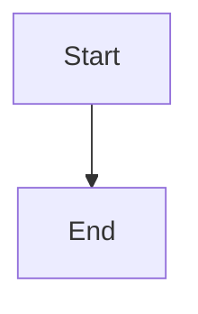

# Wiki Documentation Output Structure

This document defines the expected output structure after wiki generation.

## Directory Layout

The wiki skill generates a minimal, clean output structure:

```
{output_dir}/
├── toc.yaml               # Table of Contents definition
├── 01_overview.md         # Page 1
├── 02_architecture.md     # Page 2
├── ...                    # More pages
├── NN_topic.md            # Page N
└── _reports/
    └── SUMMARY.md         # Generation summary report (human-readable)
```

## Output Files

### Required Files

| File | Purpose | Keep? |
|------|---------|-------|
| `toc.yaml` | Master TOC definition | ✅ Always |
| `*.md` (pages) | Documentation pages | ✅ Always |
| `_reports/SUMMARY.md` | Human-readable summary | ✅ Recommended |

### Temporary Files (Deleted after generation)

These files are created during generation but should be cleaned up:

| File | Purpose | Keep? |
|------|---------|-------|
| `_context/context_pack.json` | Intermediate scan data | ❌ Delete after use |
| `_reports/structure_validation.json` | Machine-readable validation | ❌ Internal only |
| `_reports/mermaid_invalid.json` | Machine-readable diagram errors | ❌ Internal only |

## Page File Structure

Each page file follows this structure:

```markdown
<!-- PAGE_ID: project_01_overview -->
<details>
<summary>📚 Relevant source files</summary>

The following files were used as context for generating this wiki page:

- [file1.py:1-100](https://github.com/owner/repo/blob/abc/file1.py#L1-L100)
- [file2.py:50-200](https://github.com/owner/repo/blob/abc/file2.py#L50-L200)

</details>

# Page Title

> **Related Pages**: [[Other Page|02_other.md]], [[Another|03_another.md]]

---

<!-- BEGIN:AUTOGEN project_01_overview_section1 -->
## Section 1

Content with citations ([file1.py:42](url)).

Sources: [file1.py:40-50](url)
<!-- END:AUTOGEN project_01_overview_section1 -->

---

<!-- BEGIN:AUTOGEN project_01_overview_section2 -->
## Section 2

More content...



Sources: [file2.py:1-30](url)
<!-- END:AUTOGEN project_01_overview_section2 -->

---

## Manual Section

<!-- This section is manually maintained -->

Content that users can edit without being overwritten.
```

## File Naming Convention

| Pattern | Example | Description |
|---------|---------|-------------|
| `{NN}_{topic}.md` | `01_overview.md` | Numbered topic pages |
| `toc.yaml` | `toc.yaml` | Table of contents |
| `context_pack.json` | `context_pack.json` | Project context |
| `structure_validation.json` | `structure_validation.json` | Validation report |
| `mermaid_invalid.json` | `mermaid_invalid.json` | Mermaid errors |
| `SUMMARY.md` | `SUMMARY.md` | Summary report |

## Validation Reports

### structure_validation.json

```json
{
  "summary": {
    "pages_validated": 8,
    "pages_missing": 0,
    "sections_validated": 32,
    "sections_missing": 0,
    "total_errors": 0,
    "total_warnings": 0,
    "is_valid": true
  },
  "errors": [],
  "warnings": [],
  "pages": [
    {
      "filename": "01_overview.md",
      "page_id": "project_01_overview",
      "sections_found": 4,
      "autogen_sections": 4,
      "status": "✅"
    }
  ]
}
```

### mermaid_invalid.json

```json
{
  "total_invalid": 0,
  "total_scanned": 12,
  "files_affected": 0,
  "invalid_blocks": []
}
```

## Integration with Existing Docs

When generating wiki documentation, the skill should consider existing documentation:

### Scenario 1: No Existing Docs

Create the full `docs/wiki/` structure with all pages.

### Scenario 2: Existing Wiki Docs

Use **Incremental Mode** to:
1. Detect changes in source files
2. Update only affected sections
3. Preserve manual content outside AUTOGEN markers

### Scenario 3: Existing Non-Wiki Docs

The skill can:
1. Analyze existing documentation structure
2. Suggest consolidation strategy
3. Generate wiki that references or replaces existing docs
