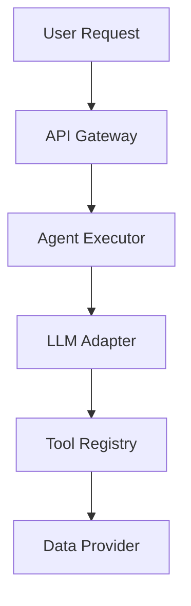
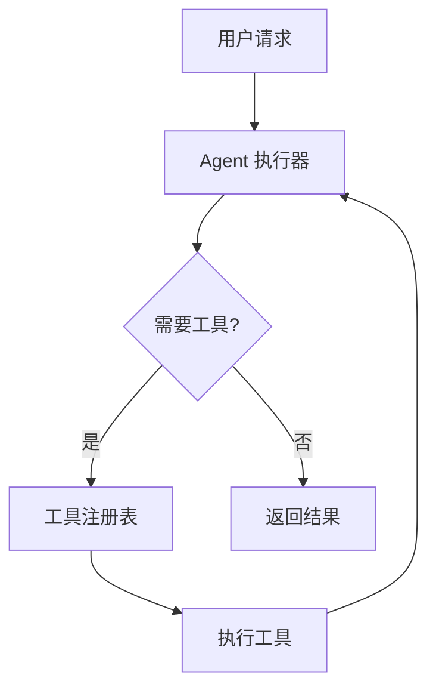

# Phase: doc-write (Phase 3)

## Goal

Generate evidence-based wiki pages from `{toc_file}` with:
- Stable PAGE_ID markers
- AUTOGEN markers for all generated sections
- Strict source citations with line numbers
- Mermaid diagrams where requested by the TOC

## Inputs

| Name | Required | Default | Description |
|------|----------|---------|-------------|
| `repo_path` | Yes | - | Absolute path to repository |
| `output_dir` | No | `docs/wiki` | Documentation output directory |
| `toc_file` | No | `{output_dir}/toc.yaml` | TOC definition file |
| `page_id` | No | - | Generate only this page (for parallel execution) |
| `language` | No | `en-US` | Output language |

## References

Read these reference files before generating:

| File | Purpose |
|------|---------|
| `/references/toc_schema.md` | Schema of toc file for parsing |
| `/references/page_template.md` | Format of wiki page |
| `/references/evidence_citation_policy.md` | Citation requirement |
| `/references/mermaid_policy.md` | Mermaid diagram rules |
| `/references/output_structure.md` | Expected output structure |

## Workflow

### Step 1: Parse TOC

Read `{toc_file}` and extract:

1. **Project metadata**: `name`, `repo_base_url`, `ref_commit_hash`, `language`
2. **Pages**: For each page, get `id`, `title`, `filename`, `source_files`
3. **Sections**: For each section, get `id`, `title`, `autogen`, `diagrams_needed`, `diagram_types`

If `page_id` is specified, only process that page (parallel execution mode).

### Step 2: Collect Source Files

For each section (recursively):

```
function collect_sources(section, page_sources):
    # Merge page-level and section-level sources
    all_sources = page_sources + section.source_files

    # Resolve glob patterns
    resolved = []
    for pattern in all_sources:
        if pattern contains '*' or '?':
            matches = glob(pattern, repo_path)
            resolved.extend(matches)
        else:
            resolved.append(pattern)

    # Read files with line numbers
    for file in resolved:
        content = read_file(file)
        # Line numbers are automatically included
```

**Important**: If understanding the code requires additional context (base classes, interfaces, imports), you MAY read additional source files beyond those specified in `source_files`.

### Step 3: Generate Page Content

For each page:

1. **PAGE_ID marker**: Add at file start
   ```markdown
   <!-- PAGE_ID: {page_id} -->
   ```

2. **Source files list**: Add collapsible section
   ```markdown
   <details>
   <summary>📚 Relevant source files</summary>

   The following files were used as context for generating this wiki page:

   - [file1.py:1-100](url)
   - [file2.ts:50-200](url)

   </details>
   ```

3. **Page title**: H1 heading
   ```markdown
   # {Page Title}

   > **Related Pages**: [[Other|02_other.md]]
   ```

4. **Sections**: For each section with `autogen: true`:
   ```markdown
   ---

   <!-- BEGIN:AUTOGEN {section_id} -->
   ## {Section Title}

   {Content with citations}

   Sources: [file.py:10-20](url)
   <!-- END:AUTOGEN {section_id} -->
   ```

### Step 4: Write Section Content

For each section:

#### 4.1 Write Introduction

1-2 sentences explaining what this section covers:

```markdown
## Architecture Overview

The system follows a layered architecture pattern with clear separation of concerns between components.
```

#### 4.2 Write Main Content

Based on `diagrams_needed`:

**With Diagram** (`diagrams_needed: true`):
1. Start with a diagram to visualize the architecture/flow
2. Follow with detailed explanations
3. Reference specific code sections with citations

**Without Diagram** (`diagrams_needed: false`):
1. Use structured text with tables where appropriate
2. Reference specific code sections with citations
3. Include code snippets for key implementations

#### 4.3 Add Citations

Follow `evidence_citation_policy.md`:

```markdown
The AgentExecutor class implements the ReAct loop pattern ([executor.py:45-120](url)).

| Method | Purpose |
|--------|---------|
| `execute()` | Main entry point for analysis ([executor.py:50-80](url)) |
| `react_loop()` | Core reasoning loop ([executor.py:85-150](url)) |

Sources: [executor.py:45-150](url), [types.py:10-30](url)
```

#### 4.4 Add Diagrams

Follow `mermaid_policy.md`:

```markdown
## Data Flow

The following diagram illustrates the data flow through the system:



Sources: [pipeline.py:20-50](url)
```

### Step 5: Handle Nested Sections

For sections with `sections` property:

```markdown
<!-- BEGIN:AUTOGEN parent_section_id -->
## Parent Section

Overview text...

<!-- BEGIN:AUTOGEN child_section_id -->
### Child Section

Details...

Sources: [file.py:10-20](url)
<!-- END:AUTOGEN child_section_id -->

<!-- BEGIN:AUTOGEN another_child_id -->
### Another Child Section

More details...
<!-- END:AUTOGEN another_child_id -->

Sources: [file.py:1-50](url)
<!-- END:AUTOGEN parent_section_id -->
```

### Step 6: Write Output

Write each page to `{output_dir}/{filename}`:

```
{output_dir}/
├── 01_overview.md
├── 02_architecture.md
├── 03_api.md
└── ...
```

## Language Guidelines

Based on `language` in TOC:

| Language Code | Section Titles | Example |
|---------------|----------------|---------|
| `en-US` | English | Introduction, Architecture, API Reference |
| `zh-CN` | Chinese | 概述, 系统架构, API 参考 |
| `ja-JP` | Japanese | 概要, アーキテクチャ, API リファレンス |

## Quality Checklist

Before writing each page:

- [ ] PAGE_ID marker at file start
- [ ] Collapsible source files list
- [ ] H1 page title
- [ ] Related pages links
- [ ] Each section has AUTOGEN markers
- [ ] Each section has at least one citation
- [ ] Diagrams follow Mermaid policy
- [ ] Language matches TOC setting

## Example Page

```markdown
<!-- PAGE_ID: greater_01_overview -->
<details>
<summary>📚 Relevant source files</summary>

The following files were used as context for generating this wiki page:

- [README.md:1-50](https://github.com/territoryLiu/greater/blob/abc123/README.md#L1-L50)
- [main.py:1-100](https://github.com/territoryLiu/greater/blob/abc123/main.py#L1-L100)
- [docs/README.md:1-80](https://github.com/territoryLiu/greater/blob/abc123/docs/README.md#L1-L80)

</details>

# 项目概述

> **Related Pages**: [[系统架构|02_architecture.md]], [[Agent 系统|03_agent_system.md]]

---

<!-- BEGIN:AUTOGEN greater_01_overview_intro -->
## 项目简介

Greater 是一个 AI 驱动的智能金融分析平台，支持多 LLM 提供商自动切换、ReAct Agent 模式和多数据源故障切换 ([README.md:1-10](url))。

平台采用前后端分离架构，后端使用 Python/FastAPI，前端使用 React/TypeScript，提供股票分析、市场复盘、知识管理和智能对话等功能 ([docs/README.md:5-15](url))。

Sources: [README.md:1-15](url), [docs/README.md:5-20](url)
<!-- END:AUTOGEN greater_01_overview_intro -->

---

<!-- BEGIN:AUTOGEN greater_01_overview_features -->
## 核心特性

### AI 智能分析

| 功能 | 描述 |
|------|------|
| 多 LLM 支持 | Gemini、Claude、GPT、AIHubMix 自动切换 ([config/llm.py:10-30](url)) |
| ReAct Agent | 推理+行动循环，支持多步工具调用 ([agent/executor.py:50-80](url)) |
| 多 Agent 协作 | 研究员 Agent + 分析师 Agent 分工协作 ([agent/roles/](url)) |



Sources: [agent/executor.py:50-150](url), [config/llm.py:10-50](url)
<!-- END:AUTOGEN greater_01_overview_features -->

---

## 手动添加的内容

<!-- This section is manually maintained -->

用户可以在此添加额外的说明、使用技巧或注意事项，这些内容不会在文档更新时被覆盖。
```

## Error Handling

### Missing Source Files

If a source file pattern matches no files:
1. Log warning
2. Continue with other sources
3. Note in section: "Source files not found for pattern: `pattern`"

### Read Errors

If file read fails:
1. Log error
2. Skip the file
3. Continue with other sources

### Invalid Diagram

If Mermaid validation fails:
1. Try to fix the diagram syntax
2. If fix fails after 3 attempts, comment out the diagram
3. Add `<!-- TODO: Fix Mermaid diagram -->` marker
```
