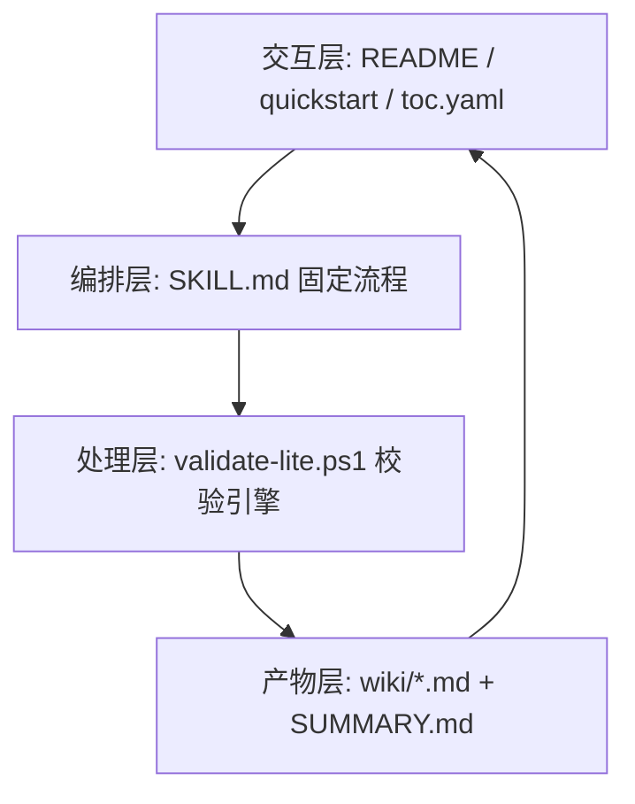

<!-- PAGE_ID: architecture -->

参考源码

- `openwiki/SKILL.md`
- `openwiki/scripts/validate-lite.ps1`
- `openwiki/templates/wiki-page.template.md`
- `openwiki/templates/SUMMARY.template.md`

# 02 系统架构与设计决策

<!-- BEGIN:AUTOGEN architecture_overview -->
## 分层架构图

- 交互层负责“导航与入口”。
- 编排层负责“流程约束与事实抽取规则”。
- 处理层负责“结构与一致性校验”。
- 产物层负责“可交付文档与质量报告”。

参考：`openwiki/SKILL.md`、`openwiki/scripts/validate-lite.ps1:142-276`
<!-- END:AUTOGEN architecture_overview -->

---

<!-- BEGIN:AUTOGEN architecture_implementation -->
## 核心组件职责

| 组件 | 职责 | 关键文件 |
|---|---|---|
| 流程定义组件 | 规定 repo-scan / toc-design / doc-write / validate-lite 的执行顺序 | `openwiki/SKILL.md` |
| 模板组件 | 提供 README、Quickstart、Wiki、Summary 的标准骨架 | `openwiki/templates/*.template.md` |
| 校验组件 | 检查 PAGE_ID、AUTOGEN 成对、README 链接、TOC 路径 | `openwiki/scripts/validate-lite.ps1` |
| 导航组件 | 维护页面 ID、标题、物理文件映射关系 | `openwiki/toc.yaml` |

参考：`openwiki/SKILL.md`、`openwiki/toc.yaml`、`openwiki/scripts/validate-lite.ps1:66-213`
<!-- END:AUTOGEN architecture_implementation -->

---

<!-- BEGIN:AUTOGEN architecture_interfaces -->
## 设计模式与 ADR（决策记录）

### ADR-001：采用“模板方法 + 固定流程”

- 决策：将流程固定为 `repo-scan -> toc-design -> doc-write -> validate-lite`。
- 原因：降低文档生成的随机性，保证团队输出结构一致。
- 代价：灵活度下降，需要额外手工扩展非标准页面。

参考：`openwiki/SKILL.md`（“固定流程（3+1）”）

### ADR-002：采用“增量标记模式”

- 决策：每个页面首段必须 `PAGE_ID`，自动区必须使用 `BEGIN/END:AUTOGEN`。
- 原因：更新自动区时不破坏人工补充内容。
- 代价：对编辑规范要求更高，标记写错会触发校验失败。

参考：`openwiki/templates/wiki-page.template.md`、`openwiki/scripts/validate-lite.ps1:100-136`

### ADR-003：采用“轻量解析而非重量依赖”

- 决策：`toc.yaml` 采用正则提取 `file:`，README 链接按 Markdown 正则提取。
- 原因：无需引入额外依赖，适配任意仓库快速运行。
- 妥协：无法覆盖所有 YAML/Markdown 极端语法，需要团队遵循规范写法。

参考：`openwiki/scripts/validate-lite.ps1:33-64`
<!-- END:AUTOGEN architecture_interfaces -->

---

## 手动补充

- 后续可在这里追加真实项目 ADR（如模型选型、数据库选型、缓存策略等）。
