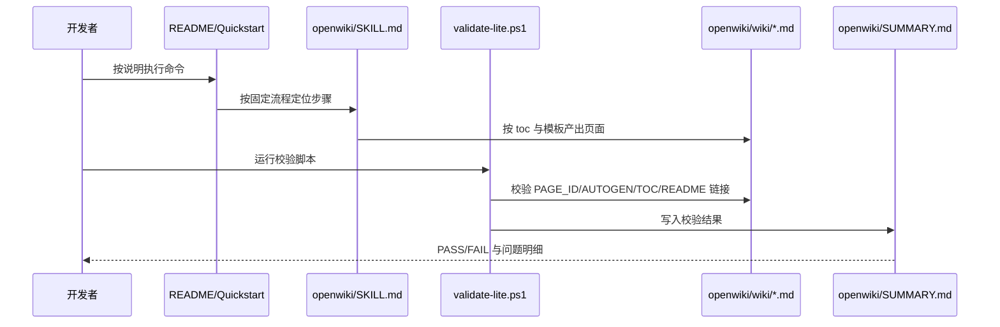

<!-- PAGE_ID: dataflow_standards -->

参考源码

- `openwiki/SKILL.md`
- `openwiki/scripts/validate-lite.ps1`
- `openwiki/templates/wiki-page.template.md`

# 03 数据流与开发规范

<!-- BEGIN:AUTOGEN dataflow_standards_overview -->
## 核心数据处理流程（端到端）

参考：`openwiki/SKILL.md`、`openwiki/scripts/validate-lite.ps1:142-286`
<!-- END:AUTOGEN dataflow_standards_overview -->

---

<!-- BEGIN:AUTOGEN dataflow_standards_implementation -->
## 语言与语法规范

### PowerShell 规范

- 启用严格模式：`Set-StrictMode -Version Latest`。
- 统一异常策略：`$ErrorActionPreference = "Stop"`。
- 参数显式化：通过 `param(...)` 声明输入契约。

参考：`openwiki/scripts/validate-lite.ps1:1-11`

### Markdown 规范

- 每个 Wiki 页第一段必须是 `<!-- PAGE_ID: ... -->`。
- 自动生成区块必须成对：`BEGIN:AUTOGEN` / `END:AUTOGEN`。
- 自动区之外为手工区，允许业务补充但不应改动自动标记语法。

参考：`openwiki/templates/wiki-page.template.md`、`openwiki/scripts/validate-lite.ps1:100-136`
<!-- END:AUTOGEN dataflow_standards_implementation -->

---

<!-- BEGIN:AUTOGEN dataflow_standards_interfaces -->
## Linter/Formatter 与状态管理原则

### Linter/Formatter

- 当前仓库未内置强制 lint 流水线，建议至少统一：
1. PowerShell：`PSScriptAnalyzer`
2. Markdown：`markdownlint`
3. 基础格式：`.editorconfig`

参考：`openwiki/scripts/validate-lite.ps1`（当前仅做结构校验，不含语法 lint）

### 状态管理机制

- 本项目为离线文档工具，不存在前端全局状态存储（无 Redux/Vuex/Zustand）。
- 状态以“文件系统 + 约定标记”为主：`toc.yaml`、`wiki/*.md`、`SUMMARY.md`。

参考：`openwiki/toc.yaml`、`openwiki/scripts/validate-lite.ps1:13-16`
<!-- END:AUTOGEN dataflow_standards_interfaces -->

---

## 手动补充

- 若后续接入 Web UI，可在此扩展请求队列、任务状态机与重试策略。
